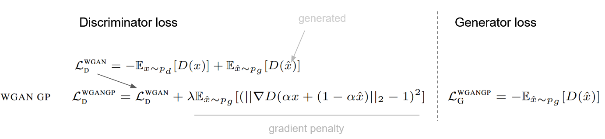
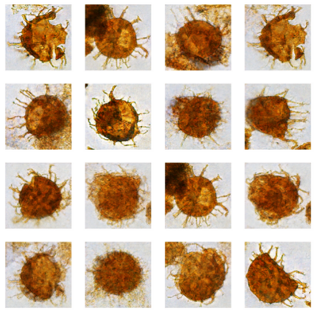

# Wasserstein Generative Adversarial Network (WGAN) TensorFlow 2

A simple implementation of WGAN written with TensorFlow 2.
The model was tested with microscopic (organic) objects, which have various morphological characteristics that the model 
must learn to reproduce.

* **Loss considered** (see [original paper](http://proceedings.mlr.press/v70/arjovsky17a.html)):


* **Results:** some mode collapse present due to small dataset used (less than 100).


## Usage
Run with Python console, e.g. the train module:
```python
python train.py --gpu_memory 0.2 --gpu_device 1 --model_folder model_001
```
The above-witten options give you possibilities to limit the usage of GPU memory up to 20% for this training, 
considering the GPU device 1 (if your infrastructure consists of 2 or more GPUs). Variables of the previously 
trained model `model_001` are restored.

Running the _create_gif_ module will generate a gif file from images generated by the generator
to visually show advancements in learning over the different epochs of learning:
```python
python create_gif.py --directory results/folder_001 --file_pattern image_*.png
```
The option `--directory` define the folder where images were saved, and `--file_pattern` determine images
to use by name pattern.
